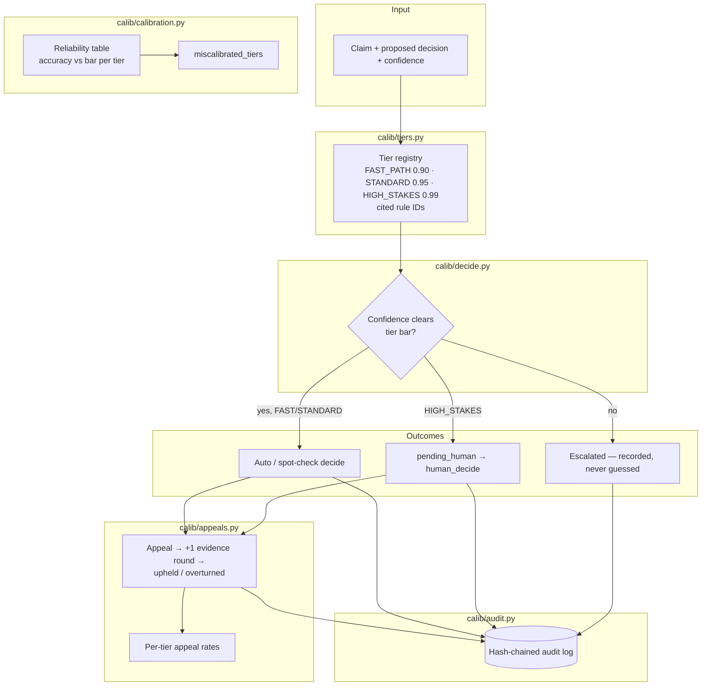

# Architecture

```mermaid
flowchart TB
    subgraph Input
        C[Claim + proposed decision + confidence]
    end
    subgraph calib/tiers.py
        R[ Tier registry<br/>FAST_PATH 0.90 · STANDARD 0.95 · HIGH_STAKES 0.99<br/>cited rule IDs ]
    end
    subgraph calib/decide.py
        D{Confidence clears<br/>tier bar?}
    end
    subgraph Outcomes
        A[Auto / spot-check decide]
        H[pending_human → human_decide]
        E[Escalated — recorded, never guessed]
    end
    subgraph calib/appeals.py
        P[Appeal → +1 evidence round →<br/>upheld / overturned]
        AR[Per-tier appeal rates]
    end
    subgraph calib/calibration.py
        RT[Reliability table<br/>accuracy vs bar per tier]
        MF[miscalibrated_tiers]
    end
    subgraph calib/audit.py
        AL[(Hash-chained audit log)]
    end
    C --> R --> D
    D -- yes, FAST/STANDARD --> A
    D -- HIGH_STAKES --> H
    D -- no --> E
    A --> P
    H --> P
    A --> AL
    H --> AL
    E --> AL
    P --> AL
    P --> AR
    RT --> MF
```

All state lives in SQLite (`calib/telemetry.py`); the audit log is a
separate hash chain. The Streamlit demo (`demo/app.py`) is a thin renderer
over `calib/demo_helpers.py`.
